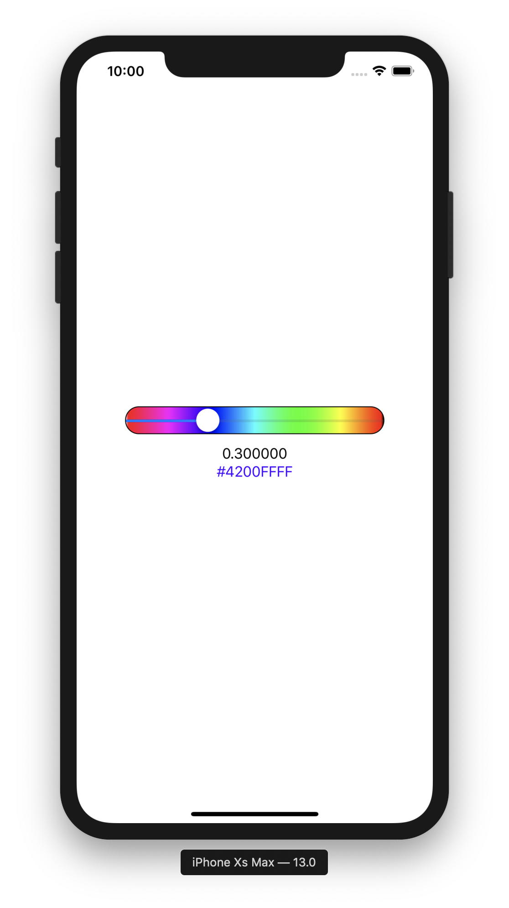
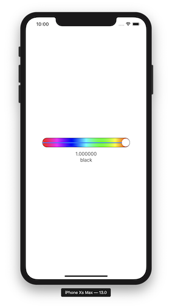

   

**ColorSlider** is a SwiftUI view (beta 5 and 6) that displays a color slider.
It is used to select a color from a range of colors.

The main elements are **ColorSlider.swift** and **ColorObject.swift**, see the demo in **ContenView.swift** for how to use it in your code.

The key to using this *ColorSlider* in your code is to create a **ColorObject** such as:

    @ObservedObject var colorObject = ColorObject()

and pass it to the *ColorSlider* as shown in *ContenView.swift*,

    ColorSlider(colorObject: colorObject, width: 300, height: 40)
    
The current color selected can be obtain from the **ColorObject** using:
    
    colorObject.color
    
The following can be set in the **ColorObject**:

- nColors, the number of colors to display in the slider, default 100.
- saturation, the desired saturation value, default 1.
- brightness, the desired brightness value, default 1.

**ColorSlider** will display a slider gradient of colors, from white to black.

To display a gray scale slider, initialise the  **ColorObject** as:

    @ObservedObject var colorObject = ColorObject(grayScale: true)

  

