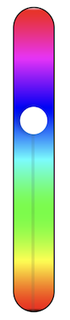
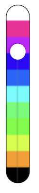

# SwiftUI ColorSlider

    

**ColorSlider** is a SwiftUI view that displays a color slider.
It is used to dynamically select a color from a range of colors or grayscale.

The main elements are **ColorSlider.swift** and **ColorObject.swift**, see the demo in **ContenView.swift** for how to use it in your code.

The key to using this *ColorSlider* in your code is to create a **ColorObject** such as:

    @ObservedObject var colorObject = ColorObject()

and pass it to the *ColorSlider* as shown in *ContenView.swift*,

    ColorSlider(colorObject: colorObject, width: 300, height: 40)
    
As the slider knob is changed, the current color selected can be obtain from the **ColorObject** using:
    
    colorObject.color
    
The following can be set to customise the **ColorObject** and thus the **ColorSlider**:

- nColors, the number of colors to display in the slider, default 100.
- saturation, the desired saturation value, default 1.
- brightness, the desired brightness value, default 1.
- isDraggable, to allow the slider to be dragged around the screen, default true
- bandSize, to set the thichness of the color bands in the slider, default 1.

**ColorSlider** will display a slider gradient of colors, from white to black.

For convenience, to display a gray scale slider, initialise the  **ColorObject** as:

    @ObservedObject var colorObject = ColorObject(grayScale: true)
    
For convenience, to display a static slider, initialise the  **ColorObject** as:

    @ObservedObject var colorObject = ColorObject(isDraggable: false)    

## Example of vertical sliders

For a vertical slider just add: 

    .rotationEffect(.degrees(90))

The color slider on the left is with the default settings.

The color slider on the right has nColors=10, and a color bandSize=10

   

